# Manual installation of TFE demo with selfsigned certificates on AWS

Here it is described how to manually install Terraform Enterpise (TFE) with selfsigned certificates on AWS.  

Official installation documentation can be found [here](https://www.terraform.io/enterprise/install/interactive/installer).  

# Prerequisites
 - AWS account
 - TFE license


# How to

## key pair
To be able to login with ssh to your ec2 instance, you'll need a key pair.  
Go to `Key pairs` and click `Create key pair`.  

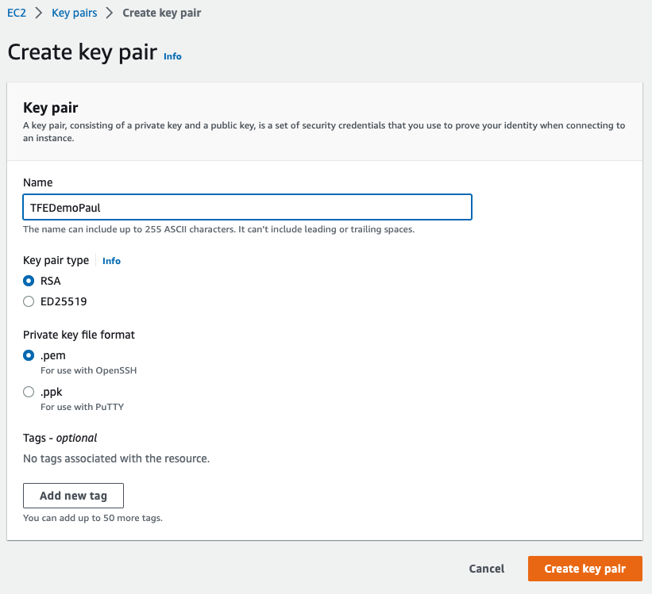  
Give it a useful name and click `Create key pair`.  

A pem file will be downloaded in the browser.  
Store this pem file in a secure location and change the permissions to only your user.  
On linux/mac:
```
chmod 0600 TFEDemoPaul.pem
```

## Security group
Allow certain ports to connect to your TFE instance.  
Go to `Security Groups` and click `Create security groups`.  

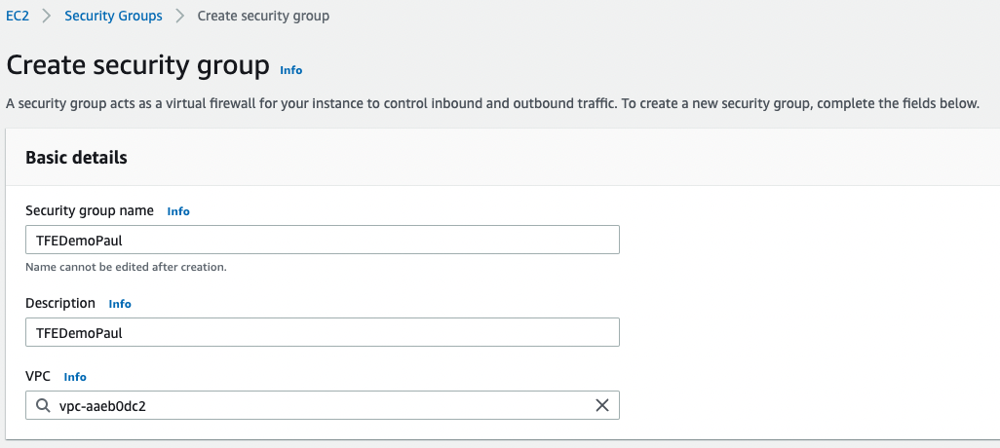  

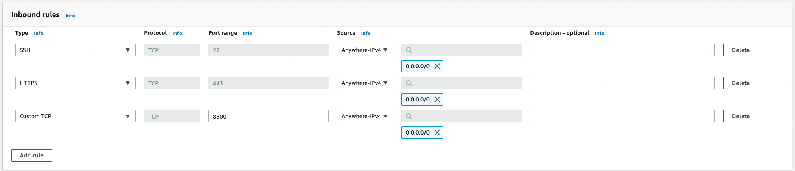  

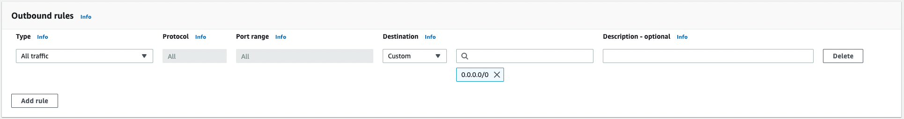  
Click `Create security groups`.  

## EC2 instance
Create an EC2 instance to install TFE on.  
Go to EC2 instances and click `Launch instances`.  

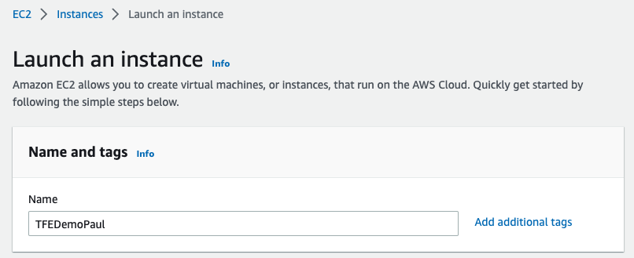  

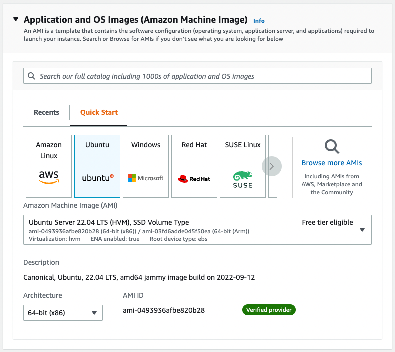  

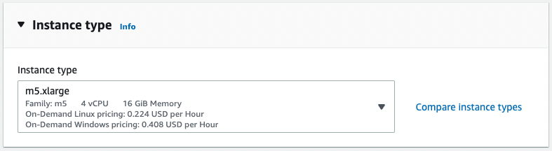  
Pick m5.xlarge  

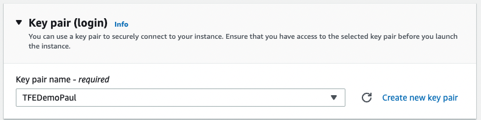  
Select the key pair created in the previous step.  

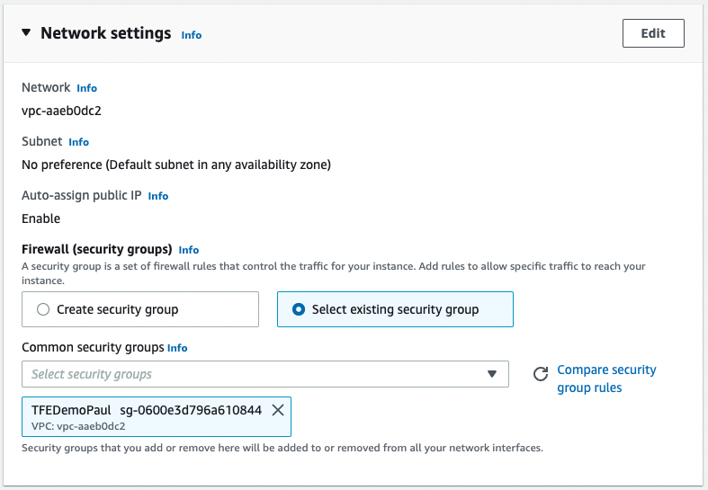  
Select the existing security group created in the previous step.  

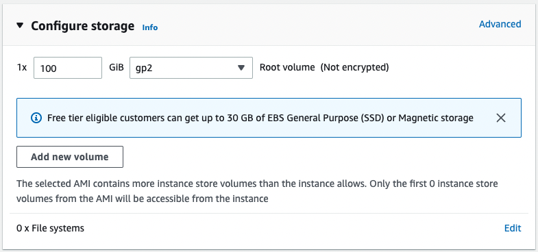  
Set the size of the disk to 100GB.  

Click `Launch instance'.  

You can login with the pem file and the public ip.  
```
ssh -i TFEDemoPaul.pem ubuntu@52.47.75.180
```

## Selfsigned certificates
Login with ssh to the EC2 instance.  

```
mkdir -p /tmp/certs
cd /tmp/certs
```

First start by creating your CA key:

```
openssl genrsa -out tfe_ca.key 2048
```

Next we need to create our CA certificate
Here you have to fill in information about your company, it does not really matter as you have to trust it yourself.

```
openssl req -new -x509 -days 1095 -key tfe_ca.key -out tfe_ca.crt -subj "/C=EX/ST=Example/L=Example/O=Example, Inc./OU=Example/CN=Example Root"
```

Next we have to create a certificate for that server we want to use SSL on

```
openssl genrsa -out tfe_server.key 2048
```

After that we need certificate request, it is here you have to fill in the domain name that you are going to use the certificate with:

```
openssl req -new -key tfe_server.key -out tfe_server.csr  -subj "/C=EX/ST=Example/L=Example/O=Example, Inc./OU=Example/CN=52.47.75.180"
```

Then lastly we can create our server certificate
```
openssl x509 -req -days 365 -in tfe_server.csr -CA tfe_ca.crt -CAkey tfe_ca.key -CAcreateserial -out tfe_server.crt
```


## TFE
Install
```
cd /tmp/
curl -o /tmp/install.sh https://install.terraform.io/ptfe/stable
chmod +x /tmp/install.sh
sudo /tmp/install.sh
```

```
Determining local address
The installer will use network interface 'ens5' (with IP address '172.31.36.235')
Determining service address
The installer will use service address '52.47.75.180' (discovered from EC2 metadata service)
The installer has automatically detected the service IP address of this machine as 52.47.75.180.
Do you want to:
[0] default: use 52.47.75.180
[1] enter new address
Enter desired number (0-1): 0
```
Use the external ip address.  

```
Does this machine require a proxy to access the Internet? (y/N) N
```

```
Operator installation successful

To continue the installation, visit the following URL in your browser:

  http://52.47.75.180:8800
```

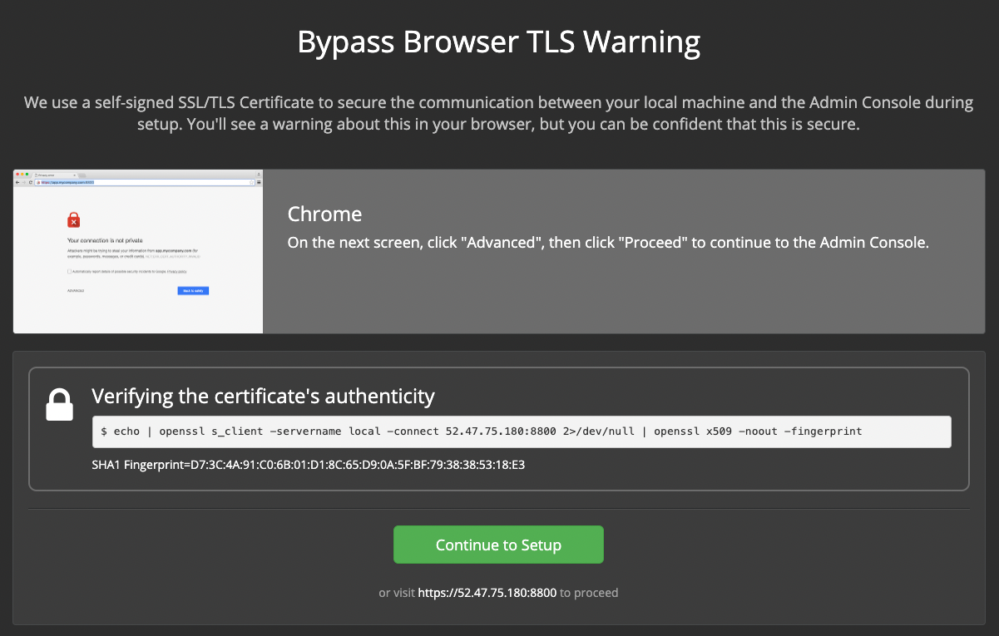  
Click `Continue to Setup`.  

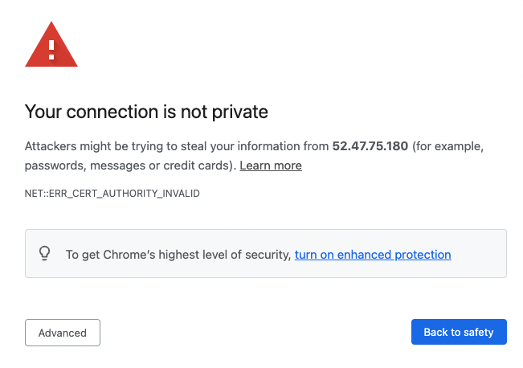  
Click `Advanced` and then `Proceed to 52.47.75.180 (unsafe)`.  

Configure `HTTPS for admin console`
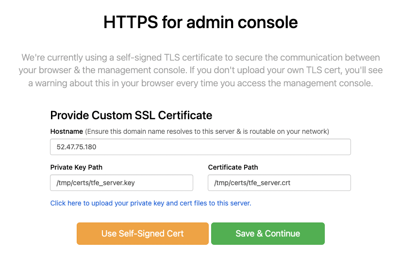  

 - Hostname: 52.47.75.180 (the CN you used with the certificate)
 - Click: If your private key and cert are already on this server, click here.
 - Private Key Path: /tmp/certs/tfe_server.key
 - Certificate Path: /tmp/certs/tfe_server.crt

Click `Save & Continue`.

Again you will get message about an unsafe connection.  
Click `Advanced` and then `Proceed to 52.47.75.180 (unsafe)`.  

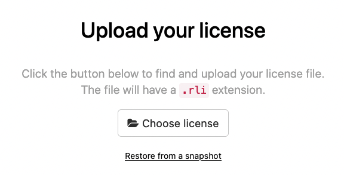  
Upload you license file.  

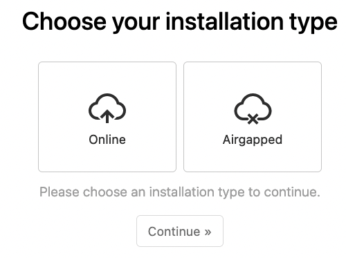  
Choose Online and continue.  

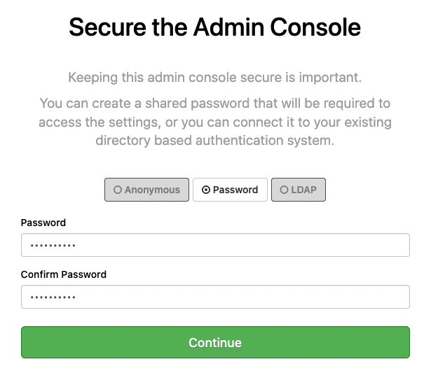  
Enter a password.  

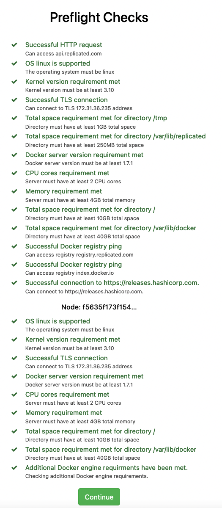  
Preflight checks should be good.  

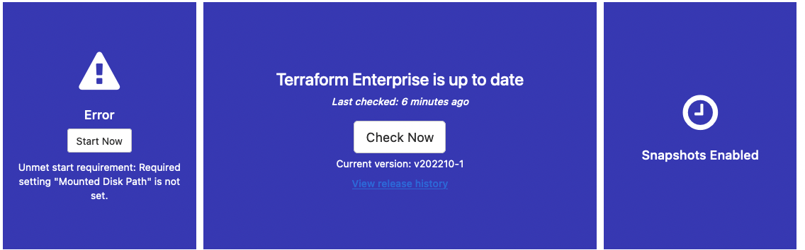  
Error that mounted disk path is not set.  

On the commandline via ssh  
```
sudo mkdir /tfe_data
```

Go to `Settings` and then `Mounted Disk Configuration`.  
Under `Mounted Disk Path` enter `/tfe_data`.  

An `Encryption Password` password is also needed.  
Go to `Encryption Password` and provide a password.  
Save.  

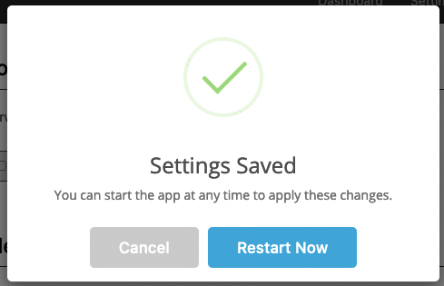  
Click `Restart Now`.  

After a few minutes you should see
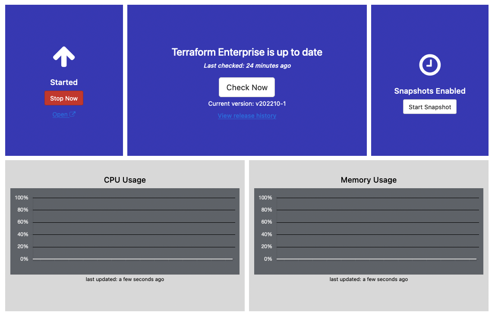  

Click on `Open` below `Stop Now`.   

Again you will get message about an unsafe connection.  
Click `Advanced` and then `Proceed to 52.47.75.180 (unsafe)`.  

Create an admin user.  
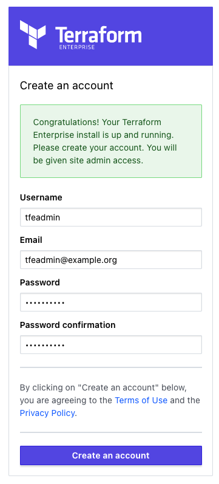   
Click `Create an account`.  

Create an organisation.  
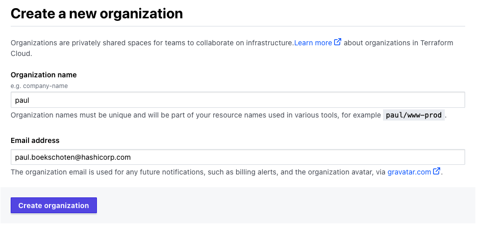  
Click `Create organization`

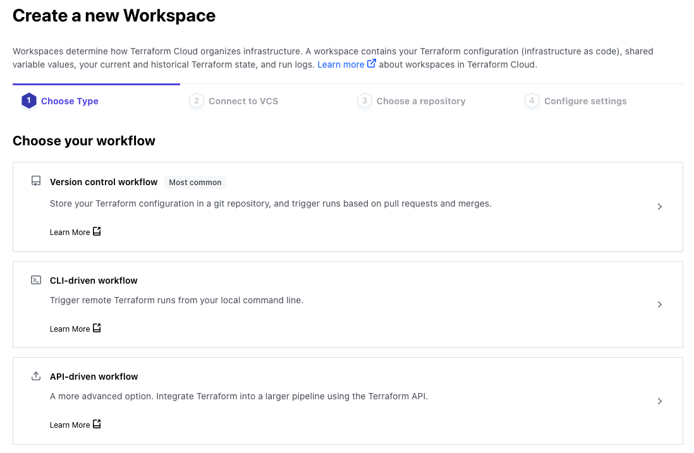  

You now have a working TFE and can create workspaces.  

